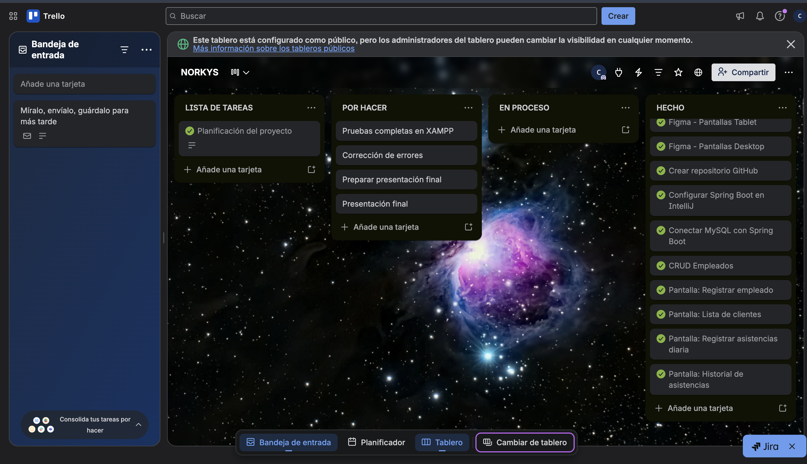
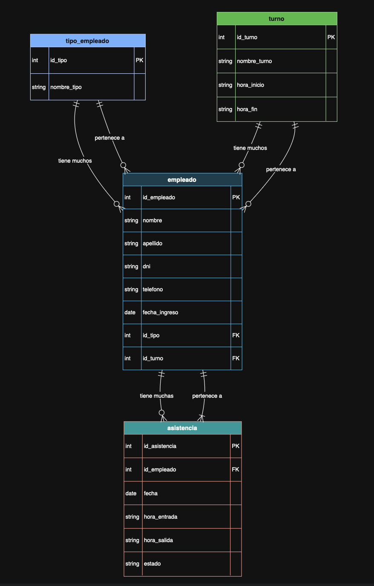
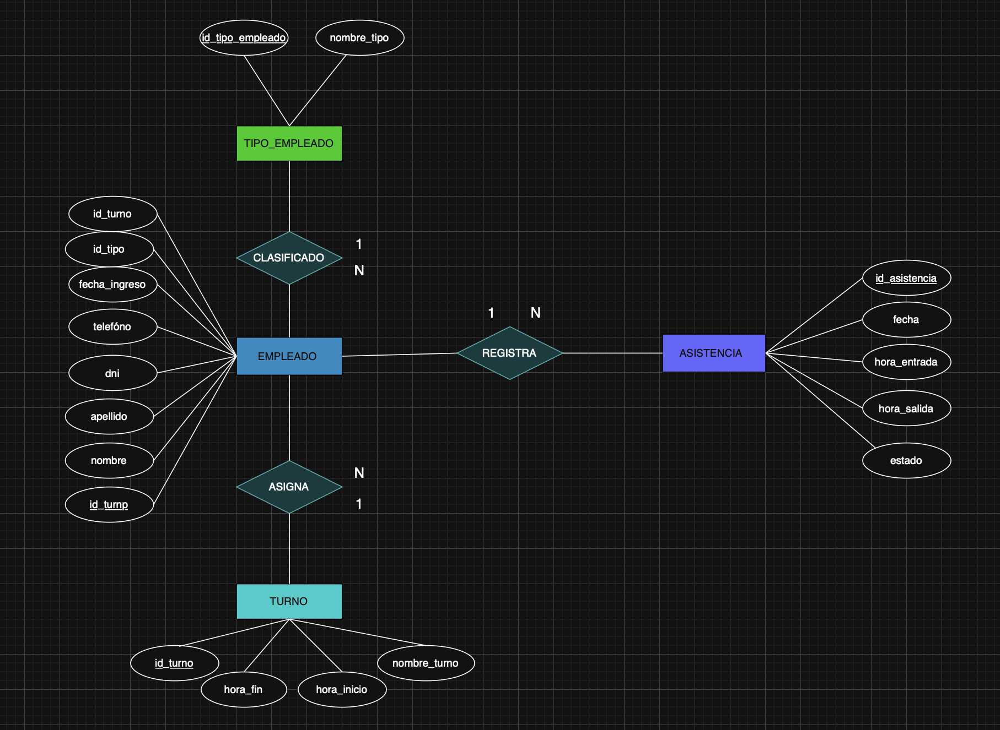

## TRELLO
Más info en [mi tablero de trello](https://trello.com/invite/b/69a1f85487e1c1e7b86cbfa5/ATTIc4af615229017a78ebfd92a03ed9a9e018678908/norkys)



# Sistema de Control de registros de Empleados y Asistencias 

## Descripcion del negocio
Nombre: Norkys SAC <br>
Giro: Restaurante de comida rápida (pollería) <br>
Tamaño: Mediana empresa con múltiples locales <br>
Contexto: Cadena de pollerías muy reconocida en el Perú, enfocada en la venta de pollo a la brasa, acompañamientos y combos familiares. Maneja gran cantidad de clientes diariamente, especialmente en horarios pico, lo que requiere una buena organización del personal y control de asistencia. <br>
Justificacion: Se necesita un sistema digital para registrar empleados y controlar su asistencia diaria, reemplazando métodos manuales, reduciendo errores y permitiendo una mejor gestión del personal en cada local.


## Identificar el problema y solución
Problema: El control de asistencia de los empleados se realiza de forma manual o desorganizada, lo que genera errores en los registros, dificultad para verificar horarios de entrada y salida, y poca claridad en la asistencia diaria del personal en cada local. <br>
Solucion tecnologica: Desarrollar un sistema web utilizando Java Spring Boot y MySQL que permita registrar empleados y controlar su asistencia diaria, almacenando horarios de entrada y salida, mostrando reportes en tiempo real y facilitando la gestión eficiente del personal.


## Requerimientos Funcionales
| Codigo | Descripcion |
|---|---|
| RF01 | El sistema debe permitir registrar un nuevo empleado con nombre, apellido, DNI, telefono y cargo |
| RF02 | El sistema debe permitir registrar la asistencia diaria de los empleados indicando fecha, hora de entrada y hora de salida |
| RF03 | El sistema debe permitir editar o actualizar los datos de un empleado |
| RF04 | El sistema debe mostrar el listado de todos los empleados registrados |
| RF05 | El sistema debe mostrar el historial de asistencia de cada empleado |
| RF06 | El sistema debe permitir identificar el estado de asistencia (asistio, falta, tardanza) |
| RF07 | El sistema debe permitir generar reportes de asistencia por fecha o rango de fechas |


## Requerimientos No Funcionales
| Codigo | Tipo | Descripcion |
|---|---|---|
| RNF01 | Rendimiento | El sistema debe cargar cada módulo (dashboard, registro de empleados y asistencia) en menos de 3 segundos para garantizar una experiencia fluida |
| RNF02 | Usabilidad | La interfaz debe ser intuitiva, clara y fácil de usar para el personal administrativo sin necesidad de capacitación previa |
| RNF03 | Seguridad | El sistema debe permitir el acceso solo a usuarios autorizados mediante autenticación con usuario y contraseña |
| RNF04 | Disponibilidad | El sistema debe estar disponible durante el horario laboral para garantizar el registro continuo de asistencia |
| RNF05 | Escalabilidad | El sistema debe permitir la gestión de múltiples empleados y adaptarse al crecimiento de nuevos locales |


## Stack completo
1. Trello             = Gestión del proyecto (Kanban)
2. Draw.io            = Diagrama ER + Diagrama de Clases
3. Figma              = Wireframe + Diseño UI/UX
4. MySQL Workbench    = Diseñar y administrar BD
5. IntelliJ           = Frontend (HTML,CSS,JS) + Backend (Spring Boot)
6. XAMPP              = Servidor Tomcat para correr la app


## Tecnologias utilizadas
- Java 17
- Spring Boot 3
- MySQL 8
- HTML5, CSS3, JavaScript
- IntelliJ IDEA
- XAMPP (Tomcat)
- MySQL Workbench
- Figma (diseño UI/UX)
- Draw.io (diagramas)


##Estructura del proyecto

```
ProyectoNORKYS/
├── backend/          → Spring Boot (Java)
│   ├── src/
│   ├── pom.xml
│   └── ...
├── frontend/         → HTML, CSS, JS
│   ├── css/
│   ├── js/
│   └── index.html
```


## Base de datos
 
El sistema cuenta con 4 tablas principales:
 
| Tabla | Descripcion |
|---|---|
| CARGO | Define los diferentes roles o puestos de trabajo dentro de la empresa (ejemplo: administrador, cajero, etc.) |
| TURNO | Define los horarios de trabajo asignados a los empleados (mañana, tarde, noche) |
| EMPLEADO | Contiene la información de los empleados registrados en el sistema |
| ASISTENCIA | Registra la asistencia diaria de los empleados, incluyendo hora de entrada, salida y estado |


  
### Diagrama Entidad-Relacion (DER)

 
### Modelo Relacional (MR)



### Cardinalidades
EMPLEADO — CARGO (N:1) <br>
Un empleado tiene un cargo, pero un cargo puede muchos empleados. <br>
EMPLEADO — TURNO (N:1) <br>
Un empleado tiene un turno, pero un turno puede tener muchos empleados. <br>
EMPLEADO — ASISTENCIA (1:N) <br>
Un empleado puede tener muchos registros de asistencia, pero un registro de asistencia pertenece a un empleado.

| Entidad A | Relacion | Entidad B | Cardinalidad |
|---|---|---|---|
| EMPLEADO | tiene | CARGO | N:1 |
| EMPLEADO | tiene | TURNO | N:1 |
| EMPLEADO | tiene | ASISTENCIA | 1:N |


 ### Base de datos
 
El sistema cuenta con 4 tablas principales:

```sql
-- =============================================
-- CREACIÓN DE LA BASE DE DATOS
-- =============================================

CREATE DATABASE IF NOT EXISTS NORKYS
DEFAULT CHARACTER SET utf8mb4
DEFAULT COLLATE utf8mb4_general_ci;

USE NORKYS;

-- =============================================
-- TABLA: CARGO
-- =============================================

CREATE TABLE CARGO (
    id_cargo INT AUTO_INCREMENT PRIMARY KEY,
    nombre_cargo VARCHAR(50) NOT NULL
);

-- =============================================
-- TABLA: TURNO
-- =============================================

CREATE TABLE TURNO (
    id_turno INT AUTO_INCREMENT PRIMARY KEY,
    nombre VARCHAR(30) NOT NULL,
    hora_inicio TIME NOT NULL,
    hora_fin TIME NOT NULL
);

-- =============================================
-- TABLA: EMPLEADO
-- =============================================

CREATE TABLE EMPLEADO (
    id_empleado INT AUTO_INCREMENT PRIMARY KEY,
    nombre VARCHAR(50) NOT NULL,
    apellido VARCHAR(50) NOT NULL,
    dni VARCHAR(8) NOT NULL,
    telefono VARCHAR(15) NULL,
    fecha_registro DATE NOT NULL,
    estado ENUM('activo', 'inactivo') DEFAULT 'activo',
    id_tipo INT NOT NULL,
    id_turno INT NOT NULL,
    FOREIGN KEY (id_tipo) REFERENCES CARGO(id_cargo),
    FOREIGN KEY (id_turno) REFERENCES TURNO(id_turno)
);

-- =============================================
-- TABLA: ASISTENCIA
-- =============================================

CREATE TABLE ASISTENCIA (
    id_asistencia INT AUTO_INCREMENT PRIMARY KEY,
    id_empleado INT NOT NULL,
    fecha DATE NOT NULL,
    hora_entrada TIME NULL,
    hora_salida TIME NULL,
    estado VARCHAR(20) NOT NULL,
    FOREIGN KEY (id_empleado) REFERENCES EMPLEADO(id_empleado) ON DELETE CASCADE,
    UNIQUE KEY unique_asistencia_dia (id_empleado, fecha)
);

-- =============================================
-- INSERCIÓN DE DATOS: CARGO
-- =============================================

INSERT INTO CARGO (nombre_cargo) VALUES
('Cajero'),
('Administrador'),
('Personal de Servicio'),
('Cocina'),
('Producción'),
('Cobradores'),
('Encargado');

-- =============================================
-- INSERCIÓN DE DATOS: TURNO
-- =============================================

INSERT INTO TURNO (nombre, hora_inicio, hora_fin) VALUES
('Turno 1', '08:00:00', '19:00:00'),
('Turno 2', '19:00:00', '22:30:00');

-- =============================================
-- INSERCIÓN DE DATOS: EMPLEADO
-- =============================================

INSERT INTO EMPLEADO (nombre, apellido, dni, telefono, fecha_registro, estado, id_tipo, id_turno) VALUES
('Carlos', 'Marin Panduro', '12345678', '987654321', '2026-02-27', 'activo', 2, 1),
('Juan', 'Perez Gomez', '87654321', '912345678', '2026-02-27', 'activo', 1, 1),
('Maria', 'Lopez Flores', '11122233', '998877665', '2026-02-27', 'activo', 4, 2),
('Ana', 'Ramirez Torres', '44455566', '987123456', '2026-02-27', 'activo', 3, 1),
('Luis', 'Encarnacion', '77788899', NULL, '2026-02-27', 'activo', 7, 1);

-- =============================================
-- INSERCIÓN DE DATOS: ASISTENCIA
-- =============================================

INSERT INTO ASISTENCIA (id_empleado, fecha, hora_entrada, hora_salida, estado) VALUES
(1, '2026-02-27', '08:00:00', '19:00:00', 'asistió'),
(2, '2026-02-27', '08:15:00', '19:00:00', 'tardanza'),
(3, '2026-02-27', '19:00:00', '22:30:00', 'asistió'),
(4, '2026-02-27', NULL, NULL, 'falta'),
(1, '2026-02-28', '08:00:00', '19:00:00', 'asistió'),
(2, '2026-02-28', '08:00:00', '19:00:00', 'asistió'),
(3, '2026-02-28', '19:05:00', '22:30:00', 'tardanza');

```

---

## Como correr el proyecto
 
### Requisitos previos
- Tener instalado IntelliJ IDEA
- Tener instalado XAMPP (para MySQL)
- Tener instalado MySQL Workbench
- Tener instalado JDK 21 o superior
 
### Backend
1. Abrir la carpeta `backend/` en IntelliJ IDEA
2. Configurar `application.properties` con los datos de MySQL
3. Iniciar XAMPP y activar MySQL
4. Ejecutar `NorkysApplication.java`
5. El backend corre en: `http://localhost:8080`
 
### Frontend
1. Abrir la carpeta `frontend/` en VsCode
2. Abrir `index.html` con Live Server
3. El frontend se comunica con el backend via fetch()
 
> El frontend y el backend corren por separado.
> El backend debe estar iniciado antes de abrir el frontend.
 ### Configuracion de base de datos
```
spring.application.name=NORKYS

#CONECCION A LA BASE DE DATOS

#La ruta de donde esta mi base de datos
spring.datasource.url=jdbc:mysql://localhost:3306/NORKYS 
#Usuario
spring.datasource.username=root
#contrasena xd
spring.datasource.password=
#esto es el puente en el que se conecta Java con Mysql (Traductor entre java y mysql)
spring.datasource.driver-class-name=com.mysql.cj.jdbc.Driver

# JPA / HIBERNATE

#Esto significa “Si cambio mis clases, actualiza la base de datos automáticamente”
spring.jpa.hibernate.ddl-auto=update
#Muestra en consola las consultas SQL
spring.jpa.show-sql=true
#Espesificamos que estamos usando Myslq 8
spring.jpa.properties.hibernate.dialect=org.hibernate.dialect.MySQL8Dialect
#Puerto del servidor
server.port=8080

#URL de las APIS
app.api.url=http://localhost:8080/
# Dar formato bonito a las consultas para que sea más legible
spring.jpa.properties.hibernate.format_sql=true

# (Opcional) Mostrar los parámetros que se usan en las consultas
spring.jpa.properties.hibernate.use_sql_comments=true
spring.web.resources.cache.period=0
spring.web.resources.chain.cache=false
```
 
---


```
